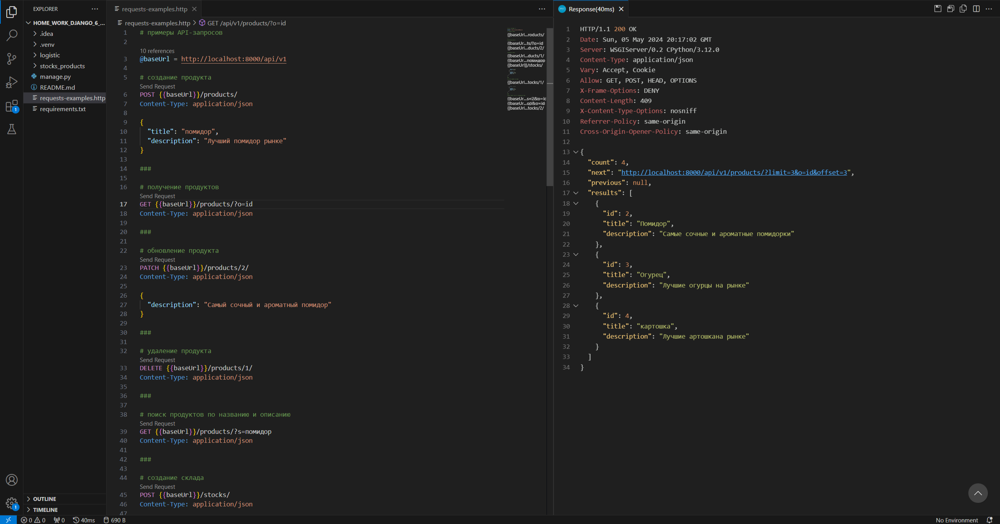

# Домашнее задание "CRUD в DRF"

## Порядок работы

Запросы можно делать из файла [requests-examples.http](requests-examples.http)

* Параметру `search` присвоено значение `s`
* Параметру `ordering` присвоено значение `o`
* Пагинация выполнена 3 записи на страницу
* пагинацию можно задавать в запросе например `?limit=3&o=id&offset=3`
```
'SEARCH_PARAM': 's',
'ORDERING_PARAM': 'o',
'PAGE_SIZE': 3
```



## Так же заполнять БД, редактировать записи,привязывать продукты к складам и т.п. можно из админ-панели


## Склады и товары

## Техническая задача: реализовать CRUD-логику для продуктов и складов, используя Django Rest Framework.

**CRUD** — аббревиатура для Create-Read-Update-Delete. Ей обозначают логику для операций создания-чтения-обновления-удаления сущностей. Подробнее: https://ru.wikipedia.org/wiki/CRUD.

## Описание

У нас есть продукты, которыми торгует компания. Продукты описываются названием и необязательным описанием (см. `models.py`). Также компания имеет ряд складов, на которых эти продукты хранятся. У продукта на складе есть стоимость хранения, поэтому один и тот же продукт может иметь разные стоимости на разных складах.

Необходимо реализовать REST API для создания, получения, обновления, удаления продуктов и складов. Так как склады имеют информацию о своих продуктах через связанную таблицу, необходимо переопределить методы создания и обновления объектов в сериализаторе (см. `serializers.py`).

Помимо CRUD-операций, необходимо реализовать поиск продуктов по названиям и описанию. И поиск складов, в которых есть определенный продукт, по идентификатору. Подробности в файле `requests-examples.http`.

Так как продуктов и складов может быть много, то необходимо реализовать пагинацию для вывода списков.

Рекомендуется обратить внимание на реализацию файлов `urls.py`. Менять их не надо, просто обратить внимание и осознать.

## Подсказки

1. Вам необходимо будет задать логику во views и serializers. В места, где нужно добавлять код, включены комментарии. После того, как вы добавите код, комментарии можно удалить.

2. Для обновления объектов удобно использовать метод `update_or_create`: https://docs.djangoproject.com/en/3.2/ref/models/querysets/#update-or-create.

## Дополнительное задание

### Поиск складов с продуктами

Реализуйте поиск складов, в которых есть определённый продукт, но при этом указывать хочется не идентификатор продукта, а название, его часть или часть описания.

Пример запроса:

```
# поиск складов, где есть определенный продукт
GET {{baseUrl}}/stocks/?search=помид
Content-Type: application/json
```

## Документация по проекту

Для запуска проекта необходимо

Установить зависимости:

```bash
pip install -r requirements.txt
```

Вам необходимо будет создать базу в postgres и прогнать миграции:

```base
manage.py migrate
```

Выполнить команду:

```bash
python manage.py runserver
```
